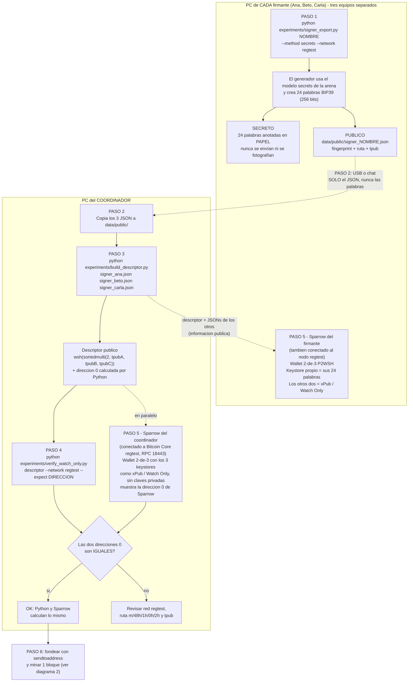
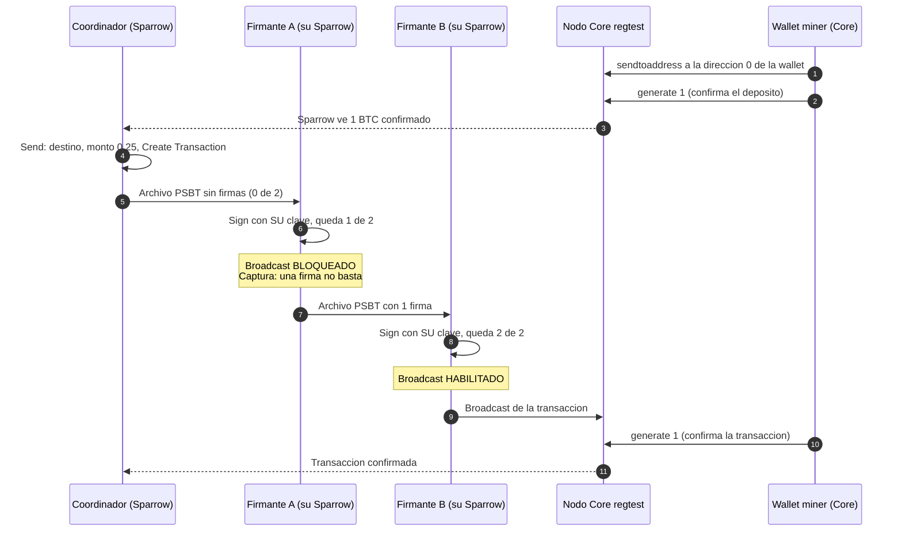
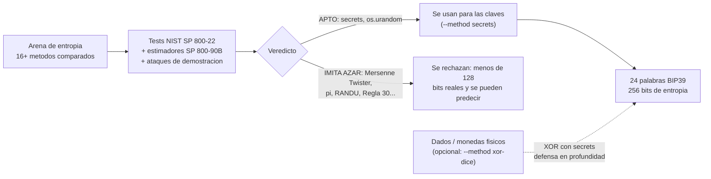

# Diagrama del flujo: de las claves a la transacción 2-de-3

Los diagramas usan [Mermaid](https://mermaid.js.org/): GitHub los dibuja automáticamente al
abrir este archivo. Las instrucciones con todos los comandos están en
[GUIA_ASSIGNMENT.md](GUIA_ASSIGNMENT.md).

## 1. Creación de la wallet (quién hace qué, y en qué computador)

Cada caja grande es **un computador distinto**. Lo único que viaja entre computadores son
archivos **públicos** (líneas punteadas). Los **secretos** (las 24 palabras) nunca salen de
su computador.

### Qué es secreto y qué es público

| Dato | ¿Secreto? | Dónde vive | ¿Va en la entrega? |
|---|---|---|---|
| 24 palabras (mnemónico) | **SÍ** | Papel del firmante y su Sparrow | **NO** |
| `tprv` / claves privadas | **SÍ** | Solo dentro del Sparrow del firmante | **NO** |
| `signer_NOMBRE.json` (fingerprint, ruta, `tpub`) | No | Se envía al coordinador | Sí |
| Descriptor `wsh(sortedmulti(2,…))` | No | Coordinador y firmantes | Sí |
| PSBT (transacción a medio firmar) | No | Pasa de firmante a firmante | Sí (capturas) |

## 2. Gastar con 2 de 3 firmas (firmas separadas)

Ningún computador tiene las tres claves: el PSBT viaja de un firmante al siguiente como
archivo. Con **una** sola firma, Sparrow bloquea el botón *Broadcast*.

## 3. Cómo se generaron las palabras (la parte de la arena)

## Resumen en una línea

**Cada firmante crea su clave en su PC → envía solo el JSON público al coordinador →
el coordinador arma el descriptor → Python y Sparrow calculan la misma dirección → se fondea
desde Core → el PSBT pasa por dos firmantes → se transmite.**
